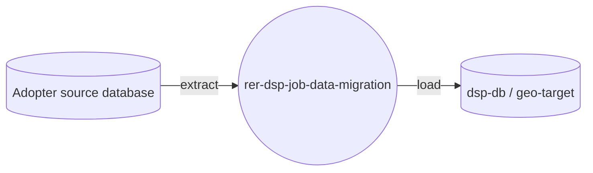

# rer-dsp-job-data-migration

> This repository is one module of the **DSP (Data Sharing Platform)**, part of the RER ecosystem.
> Full project documentation lives in **[rer-dsp-docs](https://github.com/Rural-Environmental-Registry/rer-dsp-docs)**.
> The information below covers this module only, not the DSP project as a whole.

## Where this module fits in the DSP



## Purpose

Spring Batch–based ETL that migrates geospatial data from the adopter's source database
into the DSP databases.

## Responsibilities

- Extract geospatial data from the adopter source
- Transform and validate migrated features
- Load (UPSERT) data into DSP databases (`target` and `geo-target`)

## Technologies

Java 21, Spring Boot 3.4.2, Spring Batch, PostgreSQL/PostGIS, Maven.

## How to run

```bash
./mvnw spring-boot:run
```

Or, preferably, via `rer-dsp-core` (`./setup.sh`), which orchestrates the full stack.

## License

[GNU General Public License v3.0](LICENSE)
